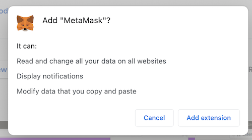
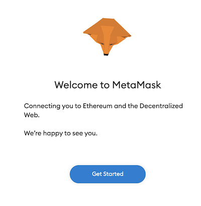
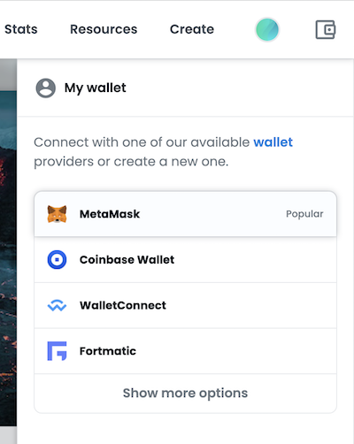

# NFT beginners guide

## Safety First

- Never open any links that are not from the official Twitter or Discord.
- Turn off DMs in Discord. The community will never DM you directly, it's probably a scam.
- Protect yourself with a hardware / cold wallet.
- Keep your Metamask pass phrase written down somewhere safe. There is no way to recover it.
- Do not interact with NFTs that you did not buy yourself. E.g. In hidden folder.
- Always make sure you are on the correct minting site and the correct OpenSea collection.

## How to connect Metamask

Install the browser extension here https://metamask.io/

Follow the guide here. [Metamask Guide](#metamask-guide)

## How to buy on OpenSea

Follow this guide here. [OpenSea Guide](#opensea-guide)

## How to Revoke Contract Permissions (Metamask)

- revoke.cash
- Etherscan also can do this
- Disconnect MM from certain sites every once in a while

# Intermediate Tips

## Useful tools

https://app.traitsniper.com/

## Flashbots

Flashbot benifits:
- No failed transactions
- Frontrunning protection
- Priority in blocks

How to add to metamask:

Enter your MetaMask and click on your RPC endpoint at the top of your MetaMask. By default it says "Ethereum mainnet".

Click “Custom RPC”

Add https://rpc.flashbots.net/ with a chainID of 1 and currency of ETH.
Scroll to the bottom and click “Save”

https://docs.flashbots.net/flashbots-protect/rpc/quick-start/

Now you can use it for every eth tx and it’s done exactly like a regular tx.

# Metamassk guide

Visit https://metamask.io/ in Google Chrome (or Brave) browser and click the Download button.

You will be take to the Chrome extension page. Click the "Add to Chrome" button.

Click "Add Extension"

In your toolbar you will see the Metamask icon. It may be hidden, if so click on the puzzle piece and you will see it there. Click on it.

This will take you to the Metamask setup in your browser. Click on the "Get Started" button.

Next click on "Create a Wallet". If you already have one setup you could import your wallet here too.

Review the terms, and agree or decline. It's not important.

Enter in a safe password. Use something long with numbers and special characters. If you haven't used a password manager before this might be a good time to start.

Click "Create" once you are happy with your password.

Next you will receive your secret recovery phrase. Click on the box to reveal it. Write it down on a piece of paper and put it somewhere safe. Do not store it in plain text on your computer. Only store it digitally in a trusted vault.

Confirm your recovery phrase by dragging the words into the big box in the correct order. Once you are happy click "Confirm"

That's it! You're all done. You can now start transacting.

Your wallet address is highlighted in red in the image. You can copy the address by clicking on it. Now you can go and deposit some ETH and buy some NFTs mfer.

# OpenSea Guide

The first thing you need to do is connect your Metamask Wallet. Click on the wallet button highlighted below.

Select Metamask from the list.

Now you need to allow OpenSea access to your wallet. Click the "Next" button.

Not sign the contract by clicking the "Connect" button.

You should see your wallet balance now. You'll need some funds to be able to buy an NFT... Maybe one day this wallet will have some money...

**Hint hint... 0x160a0E9FB38db0db12b0e8596a07f5240D166aF7**

Now to find a collection that you believe in. This is a process on it's own. Do not search OpenSea there are too many scams on there. Use a link from the official Twitter or Discord.

Once you've found your long HODL you need to find the right NFT. If a project is selling fast you won't want to buy off the top 2 rows, but try and find something that suits your taste and budget. You can look at the rarity tools in the [Useful Links](#useful-links) section or you can go with your gut.

Click through to the NFT page itself. Often the items on the floor have already been sold and you risk losing gas if you are not careful.

If you see the big blue "Buy now" button you've got a chance. Click it.

Check the box to confirm the purchase. You'll need enough funds in your wallet to continue. Click the "Confirm checkout" button.

Metamask will open and will give you an estimate gas fee. If you have enough funds for the transaction and the gas the "Confirm" button will be active. If you are happy with your purchase click the button.

Congratulations!! You just bought your first NFT!!
